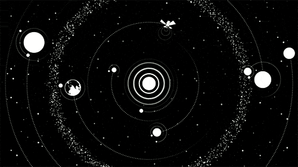

<h1 align="center">Hi 👋, I'm Carol Vílchez</h1>

<h3 align="center">Welcome to My Github!</h3>

# 💫 About Me:
I am  a junior full stack developer. My hobbies include astronomy 🔭 and getting lost on a weekend in nature 🌳⛺ where I go hiking.

# 💻 Tech Stack:
               	   
# 📊 GitHub Stats:
 
 

